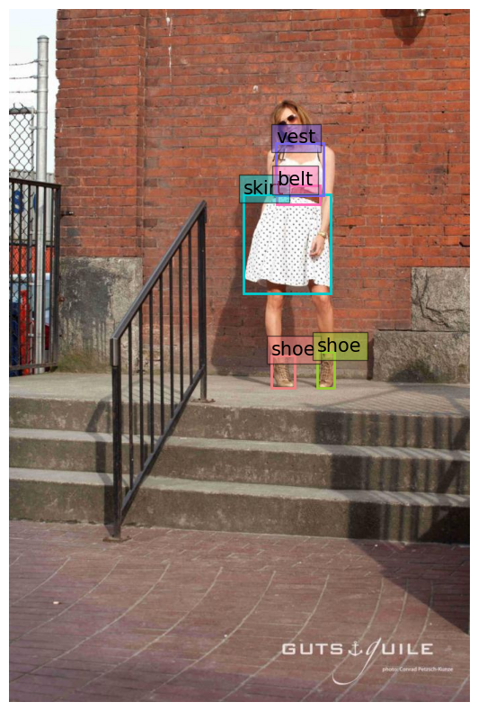

<a href="https://colab.research.google.com/github/valntinaf/fine-tunning-a-YOLOs/blob/main/17_Fine_tuning_YOLOS_for_object_detection_on_fashion.ipynb" target="_parent"></a>


First of all we are going to install a couple of libraries needed for interacting with Hugging Face. We are going to use HuggingFace for downloading a pretrained model and a dataset we will use for fine-tunning it.

- Lighting: PyTorch Lighting will provide a high-level interface for PyTorch, a popular machine learning framework.
- Datasets: A library for interacting with uploaded datasets available on the Hugging Face Hub.
- Transformers: A library for interacting with pre-trained models available on the Hugging Face Hub.


```python
%%capture
!pip install lightning
!pip install datasets
!pip install transformers
```


```python
!huggingface-cli login
```


```python
import datasets
import lightning as pl
from lightning import Trainer
from torch.utils.data import DataLoader
from torchvision import transforms
from transformers import AutoFeatureExtractor
from transformers import AutoModelForObjectDetection
import matplotlib.pyplot as plt
import torch
import random
```


```python
def xyxy_to_xcycwh(box):
    x1, y1, x2, y2 = box.unbind(dim=1)
    width = x2-x1
    height = y2-y1
    xc = x1 + width*0.5
    yc = y1 + height*0.5
    b = [xc, yc, width, height]
    return torch.stack(b, dim=1)

def cxcywh_to_xyxy(x):
    x_c, y_c, w, h = x.unbind(1)
    x1 = x_c - 0.5 * w
    y1 = y_c - 0.5 * h
    x2 = x_c + 0.5 * w
    y2 = y_c + 0.5 * h
    b = [x1, y1, x2, y2]
    return torch.stack(b, dim=1)
```


```python
COLORS = ['lightcoral', 'yellowgreen', 'darkturquoise', 'hotpink', 'mediumslateblue']

def rescale_bboxes(out_bbox, size, down=True):
    img_w, img_h = size
    if down:
        b = torch.Tensor(out_bbox) / torch.tensor([img_w, img_h, img_w, img_h], dtype=torch.float32)
    if not down:
        b = torch.Tensor(out_bbox) * torch.tensor([img_w, img_h, img_w, img_h], dtype=torch.float32)
    return b

def plot_results(pil_img, boxes, class_labels):
    plt.figure(figsize=(16,10))
    plt.imshow(pil_img)
    ax = plt.gca()
    colors = COLORS * 100
    for (xmin, ymin, xmax, ymax), c, label in zip(boxes, colors, class_labels):
        ax.add_patch(plt.Rectangle((xmin, ymin), xmax - xmin, ymax - ymin,
                                   fill=False, color=c, linewidth=2))
        ax.text(xmin, ymin, str(label), fontsize=15,
                bbox=dict(facecolor=c, alpha=0.5))
    plt.axis('off')
    plt.show()
```

## Downloading and visualizing the fashionpedia dataset


```python
train_dataset = datasets.load_dataset("detection-datasets/fashionpedia", split=datasets.ReadInstruction("train",from_=0, to=50, unit="%", rounding="pct1_dropremainder"))
val_dataset = datasets.load_dataset("detection-datasets/fashionpedia", split=datasets.ReadInstruction("train",from_=5, to=6, unit="%", rounding="pct1_dropremainder"))
```

    Using custom data configuration detection-datasets--fashionpedia-fd367b48ab385b58
    Found cached dataset parquet (/Users/valentina/.cache/huggingface/datasets/detection-datasets___parquet/detection-datasets--fashionpedia-fd367b48ab385b58/0.0.0/2a3b91fbd88a2c90d1dbbb32b460cf621d31bd5b05b934492fdef7d8d6f236ec)
    Using custom data configuration detection-datasets--fashionpedia-fd367b48ab385b58
    Found cached dataset parquet (/Users/valentina/.cache/huggingface/datasets/detection-datasets___parquet/detection-datasets--fashionpedia-fd367b48ab385b58/0.0.0/2a3b91fbd88a2c90d1dbbb32b460cf621d31bd5b05b934492fdef7d8d6f236ec)


```python
cats = train_dataset.features['objects'].feature['category']
cats

def idx_to_text(indexes):
    labels = []
    for i in indexes:
        labels.append(cats.names[i])
    return labels
```


```python
train_dataset
```


    Dataset({
        features: ['image_id', 'image', 'width', 'height', 'objects'],
        num_rows: 22800
    })


```python
val_dataset
```


    Dataset({
        features: ['image_id', 'image', 'width', 'height', 'objects'],
        num_rows: 456
    })


```python
random_i = random.randint(0, train_dataset.num_rows)
print(f"Plotting random item {random_i}")
random_item = train_dataset[random_i]
plot_results(random_item['image'], random_item['objects']['bbox'], idx_to_text(random_item['objects']['category']))
```

    Plotting random item 1155


    

    


### Preprocessing our dataset


```python
# In order to use our images for the training, we're going to preprocess them, it is possible to use the YOLOs preprocessor.
feature_extractor = AutoFeatureExtractor.from_pretrained("hustvl/yolos-small", size=816, max_size=864)
```


```python
def transform(batch):
    inputs = {}
    inputs['pixel_values'] = feature_extractor(batch['image'], return_tensors='pt')['pixel_values']
    labels = []
    bbox = [rescale_bboxes(batch['objects'][i]['bbox'], (batch['width'][i], batch['height'][i])) for i in range(len(batch['objects']))]
    bbox = [xyxy_to_xcycwh(torch.Tensor(bbox_i)) for bbox_i in bbox]
    labels.append({
        "boxes": bbox,
        "class_labels": [object['category'] for object in batch['objects']],
        "image_id": torch.Tensor([batch['image_id']]).int(),
        "area": [object['area'] for object in batch['objects']],
        "iscrowd": torch.Tensor([0 for _ in batch['objects']]).int(),
        "orig_size": torch.Tensor([(batch['width'], batch['height'])]).int(),
        "size": torch.Tensor([inputs['pixel_values'].shape[1:]])[0].int(),
    })
    inputs['labels'] = labels
    return inputs
```


```python
train_dataset.map(transform, batched=True)
```


      0%|          | 0/23 [00:00<?, ?ba/s]


```python
prepared_train = train_dataset.with_transform(transform)
prepared_val = val_dataset.with_transform(transform)
```


```python
def collate_fn(batch):
    collated = {}
    collated["pixel_values"] = feature_extractor.pad([item['pixel_values'] for item in batch], return_tensors="pt")['pixel_values']
    collated["labels"] = []
    for item in batch:
        item['labels']['boxes'] = torch.stack(item['labels']['boxes'])[0]
        item['labels']['area'] = torch.Tensor(item['labels']['area'])
        item['labels']['class_labels'] = torch.Tensor(item['labels']['class_labels'])[0]
        item['labels']['class_labels'] = item['labels']['class_labels'].type(torch.LongTensor)
        collated["labels"].append(item['labels'])
    return collated
```


```python
print("Number of training examples:", len(train_dataset))
print("Number of validation examples:", len(val_dataset))
```


```python
BATCH_SIZE = 1
train_dataloader = DataLoader(prepared_train, collate_fn=collate_fn, batch_size=BATCH_SIZE)
val_dataloader = DataLoader(prepared_val, collate_fn=collate_fn, batch_size=BATCH_SIZE)
```


```python
item = next(iter(train_dataloader))
```


```python
item
```


```python
random_i = random.randint(0, BATCH_SIZE-1)
random_i = 0
pil_image = transforms.ToPILImage()(item['pixel_values'][random_i])
class_labels = item['labels'][random_i]['class_labels']
size = pil_image.size
boxes = rescale_bboxes(cxcywh_to_xyxy(item['labels'][random_i]['boxes']), size, down=False)
plot_results(pil_image, boxes, idx_to_text(class_labels.tolist()))
```


```python
class Detr(pl.LightningModule):

     def __init__(self, lr, weight_decay):
         super().__init__()
         self.model = AutoModelForObjectDetection.from_pretrained("hustvl/yolos-small", 
                                                             num_labels=cats.num_classes,
                                                             ignore_mismatched_sizes=True)
         self.lr = lr
         self.weight_decay = weight_decay

     def forward(self, pixel_values):
       outputs = self.model(pixel_values=pixel_values)
       return outputs
     
     def common_step(self, batch, batch_idx):
       pixel_values = batch["pixel_values"]
       labels = [{k: v.to(self.device) for k, v in t.items()} for t in batch["labels"]]

       outputs = self.model(pixel_values=pixel_values, labels=labels)

       loss = outputs.loss
       loss_dict = outputs.loss_dict

       return loss, loss_dict

     def training_step(self, batch, batch_idx):
        loss, loss_dict = self.common_step(batch, batch_idx)     
        self.log("training_loss", loss)
        for k,v in loss_dict.items():
          self.log("train_" + k, v.item())

        return loss

     def validation_step(self, batch, batch_idx):
        loss, loss_dict = self.common_step(batch, batch_idx)     
        self.log("validation_loss", loss)
        for k,v in loss_dict.items():
          self.log("validation_" + k, v.item())

        return loss

     def configure_optimizers(self):
        optimizer = torch.optim.AdamW(self.parameters(), lr=self.lr,
                                  weight_decay=self.weight_decay)
        
        return optimizer

     def train_dataloader(self):
        return train_dataloader

     def val_dataloader(self):
        return val_dataloader
```


```python
# Start tensorboard.
%load_ext tensorboard
%tensorboard --logdir lightning_logs/
```

Here we define the model, and verify the outputs.


```python
model = Detr(lr=2.5e-5, weight_decay=1e-4)
```


```python
model
```


```python
trainer = Trainer(max_epochs=1, accelerator="cpu", devices=1)
trainer.fit(model)
```


```python
model
```


```python
model.model.push_to_hub("yolos-fashionpedia")
```


```python

```
